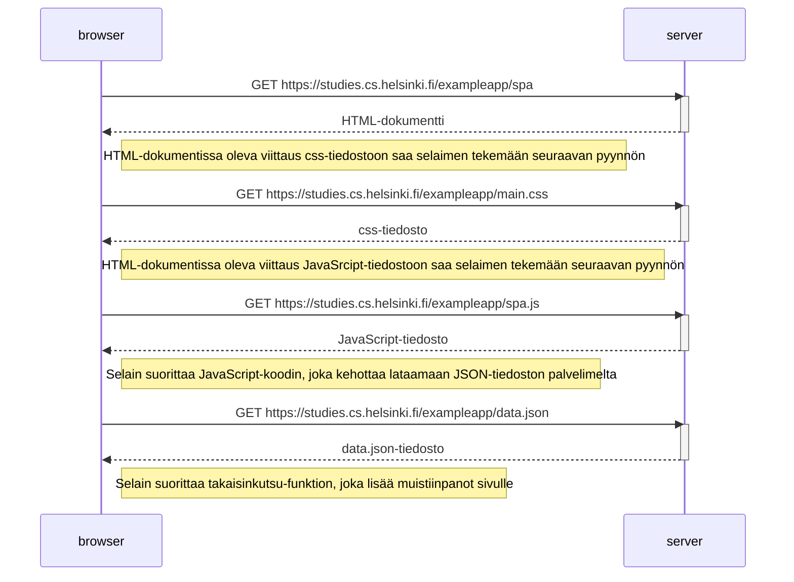

```mermaid
sequenceDiagram
    participant browser
    participant server

    browser->>server: GET https://studies.cs.helsinki.fi/exampleapp/spa
    activate server
    server-->>browser: HTML-dokumentti
    deactivate server

    Note right of browser: HTML-dokumentissa oleva viittaus css-tiedostoon saa selaimen tekemään seuraavan pyynnön
    
    browser->>server: GET https://studies.cs.helsinki.fi/exampleapp/main.css
    activate server
    server-->>browser: css-tiedosto
    deactivate server

    Note right of browser: HTML-dokumentissa oleva viittaus JavaSrcipt-tiedostoon saa selaimen tekemään seuraavan pyynnön
    
    browser->>server: GET https://studies.cs.helsinki.fi/exampleapp/spa.js
    activate server
    server-->>browser: JavaScript-tiedosto
    deactivate server
    
    Note right of browser: Selain suorittaa JavaScript-koodin, joka kehottaa lataamaan JSON-tiedoston palvelimelta
    
    browser->>server: GET https://studies.cs.helsinki.fi/exampleapp/data.json
    activate server
    server-->>browser: data.json-tiedosto
    deactivate server    

    Note right of browser: Selain suorittaa takaisinkutsu-funktion, joka lisää muistiinpanot sivulle
```